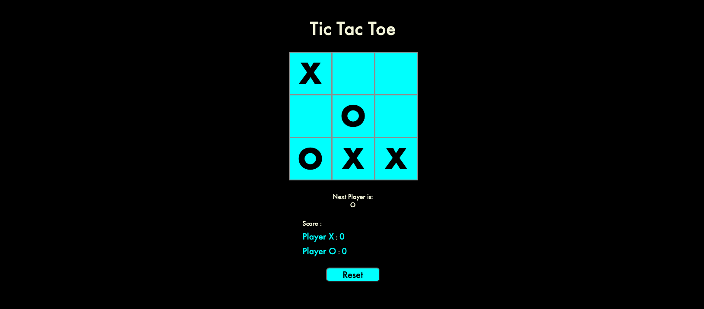
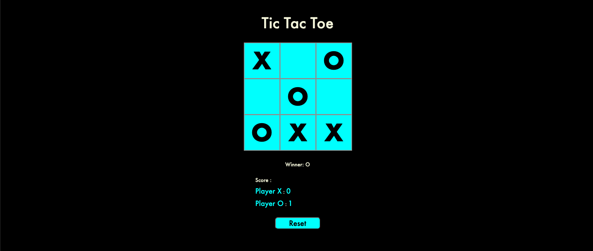
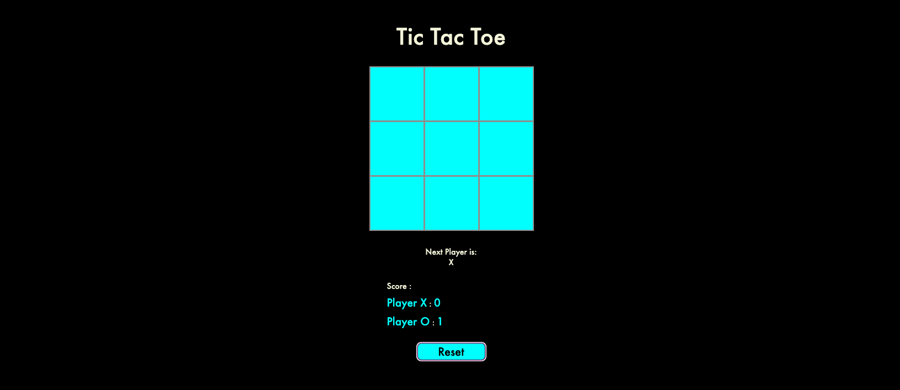

#  Tic Tac Toe 

##  Installation: 
In order to get this project up and running, please open the project and install all modules from the package.json file. This can be accomplished
by the following command via CLI: 

`npm i` 

##  Up and Running: 
Once your Node modules are installed, you can start the application by running

`npm start`

`Open http://localhost:3000 to view your game of Tic Tac Toe!`

###  For this project I employed all of the new things I have learned.  

- React.
- React-dom.
- React-scripts.
- React-router-dom.
- Node.

##  How to use the front end as a user:  

Introduction 
  - At the landing page <q> Tic Tac Toe </q> and the <q> Game Board </q> are displayed. Text displaying the <q> Next Player </q> and a <q> Score Board </q> that keeps track of each players score. As well as a <q> Reset </q> button to restart the game.
 

 First Stage 

- Users can `Click` on any square they like to make their selction.
- Either and `X` or an `O` will appear depending on which player is currently selecting.

 

 Second Stage 

- Once `Three` of the same symbol are in a row the game will end and the winner will be named.

 

- Clicking the `Reset` button will start a new game.

- The score board will keep track of the `Score`.

 

##  Styles used for this project.  

###  Colors:  

- #f4f4db
- #00ffff
- #000
- #999
- #ddd

###  Fonts:  

- Century Gothic. 
- Futura. 
- Sans-serif.